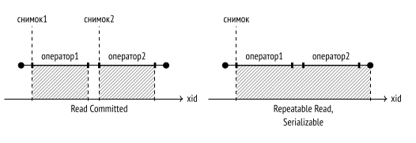
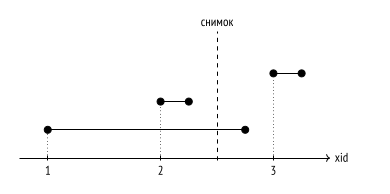
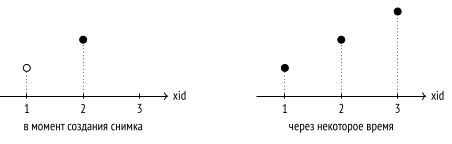
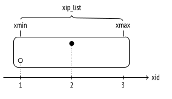

# Снимки данных

* [Что такое снимки данных](#sn)
* [Видимость версий строк в снимке](#vis)
* [Из чего состоит снимок](#snm)
* [Видимость собственных изменений](#int)
* [Горизонт транзакции](#gor)
* [Снимок данных для системного каталога](#sys)
* [Экспорт снимка данных](#exp)

<a name="sn"></a>

## Что такое снимки данных

Физически в страницах данных могут находиться несколько версий одной и той же строки, хотя каждая транзакция должна видеть максимум одну из них. Все вместе версии разных строк, наблюдаемые транзакцией, образуют снимок данных (snapshot). Снимок обеспечивает согласованную в ACID-смысле картину данных на определенный момент времени и содержит только самые актуальные данные, зафиксированные к моменту его создания.

Чтобы обеспечить изоляцию, каждая транзакция работает со своим собственным снимком. При этом разные транзакции видят разные, но тем не менее согласованные (на разные моменты времени) данные.

На уровне изоляции Read Committed снимок создается в начале каждого оператора транзакции и остается активным все время работы этого оператора.

На уровнях Repeatable Read и Serializable снимок создается один раз в начале первого оператора транзакции и остается активным до самого конца транзакции.



<a name="vis"></a>

## Видимость версий строк в снимке

снимок данных не является физической копией всех необходимых версий строк. Фактически снимок задается несколькими числами, а видимость версий строк в снимке определяется правилами.

Будет данная версия строки видна в снимке или нет — зависит от полей xmin и xmax ее заголовка (то есть от номеров создавшей и удалившей транзакций) и от соответствующих этим полям информационных битов. Интервалы xmin–xmax не пересекаются, поэтому каждая строка представлена в любом снимке максимум одной своей версией.

Точные правила видимости 1 довольно сложны и учитывают множество различных ситуаций и крайних случаев. Упрощая, можно сказать, что версия строки видна, когда в снимке видны изменения, сделанные транзакцией xmin, и не видны изменения, сделанные транзакцией xmax (иными словами, если версия строки уже появилась, но еще не удалена).

В свою очередь, изменения транзакции видны в снимке, если эта транзакция была зафиксирована до момента создания снимка. И еще, в качестве исключения из общего правила, транзакция видит в снимке свои собственные еще не зафиксированные изменения. Изменения оборванных транзакций, разумеется, ни в одном снимке не видны.

Транзакции изображены в виде отрезков (от момента начала до момента фиксации):



Здесь:

* изменения транзакции 2 будут видны, потому что она завершилась до создания снимка;

* изменения транзакции 1 не будут видны, потому что она была активна на момент создания снимка;

* изменения транзакции 3 не будут видны, потому что она началась позже создания снимка (не важно, закончилась она или нет).

<a name="snm"></a>

## Из чего состоит снимок

К сожалению, PostgreSQL видит картину совсем не так 1, как было показано на рисунке. Дело в том, что системе неизвестно, когда транзакции были зафиксированы. Известно только, когда они начинались (этот момент определяется номером транзакции), а вот факт завершения нигде не записывается.

Узнать можно лишь текущий статус транзакций. Эта информация есть в общей памяти сервера в структуре ProcArray, которая содержит список всех активных сеансов и их транзакций. Постфактум же невозможно выяснить, была ли какая-то транзакция активна в момент создания снимка.

Поэтому для получения снимка недостаточно сохранить момент его создания: требуется также запомнить, в каком статусе находились транзакции на этот момент. Без информации о статусах впоследствии невозможно будет понять, какие версии строк должны быть видны в снимке, а какие — нет.

Сравните, какая информация доступна системе в момент создания снимка и некоторое время спустя (белым кружком обозначена активная транзакция, а черными — завершенные):



Если не запомнить, что во время создания снимка первая транзакция еще выполнялась, а третьей не существовало, их невозможно будет отличить от зафиксированной на тот момент второй транзакции и исключить из рассмотрения.

По этой причине в PostgreSQL нельзя создать снимок, показывающий согласованные данные по состоянию на некоторый момент в прошлом, даже если все необходимые для этого версии строк существуют в табличных страницах. Соответственно, невозможно реализовать и ретроспективные (темпоральные, flashback) запросы.

Итак, снимок данных состоит из нескольких значений, которые запоминаются в момент его создания 2:

* **Нижняя граница снимка xmin**, в качестве которой выступает номер самой старой активной транзакции. Все транзакции с меньшими номерами либо зафиксированы, и тогда их изменения видны в снимке, либо отменены, и тогда изменения игнорируются.

* **Верхняя граница снимка xmax**, в качестве которой берется значение, на единицу большее номера последней зафиксированной транзакции. Верхняя граница определяет момент времени, в который был сделан снимок. Все транзакции с номерами, большими или равными xmax, не завершены или не существуют, и поэтому изменения таких транзакций точно не видны.

* **Список активных транзакций xip_list** в который попадают номера всех активных транзакций (меньшие xmax), за исключением виртуальных, которые никак не влияют на видимость.

Графически можно представить снимок как прямоугольник, охватывающий транзакции от xmin до xmax:



Чтобы посмотреть, как видимость определяется снимком, воспроизведем ситуацию по показанному выше сценарию на таблице accounts.

``` sql
TRUNCATE TABLE accounts;
```

Первая транзакция вставляет в таблицу первую строку и остается активной:

``` sql
BEGIN;
INSERT INTO accounts VALUES (1, 'alice', 1000.00);
SELECT pg_current_xact_id();

 pg_current_xact_id 
--------------------
                786
(1 строка)
```

Вторая транзакция вставляет вторую строку и сразу завершается:

``` sql
BEGIN;
INSERT INTO accounts VALUES (2, 'bob', 100.00);
SELECT pg_current_xact_id();

 pg_current_xact_id 
--------------------
                788
(1 строка)

COMMIT;
```

В этот момент (в другом сеансе) создаем новый снимок. Для этого достаточно выполнить любой запрос, но мы сразу посмотрим на снимок с помощью специальной функции:

``` sql
BEGIN ISOLATION LEVEL REPEATABLE READ;
SELECT pg_current_snapshot();

 pg_current_snapshot 
---------------------
 786:789:786
(1 строка)
```

Функция выводит через двоеточие три составляющих снимка: поля xmin, xmax и список xip_list (состоящий в данном случае из одного номера).

После того как снимок создан, завершаем первую транзакцию:

``` sql
COMMIT;
```

Третья транзакция выполняется после создания снимка и меняет вторую строку. Появляется новая версия:

``` sql
BEGIN;
UPDATE accounts SET amount = amount + 100 WHERE id = 2;
SELECT pg_current_xact_id();

 pg_current_xact_id 
--------------------
                790
(1 строка)

COMMIT;
```

В созданном снимке видна только одна версия:

``` sql
SELECT ctid, * FROM accounts;

```

// todo

Хотя в таблице их три:

``` sql
SELECT * FROM heap_page('accounts',0);
```

Как PostgreSQL понимает, какие версии показывать? По сформулированным выше правилам в снимке видны изменения только следующих зафиксированных транзакций:

* с номерами xid < xmin — безусловно (например, транзакция, создавшая таблицу accounts);
* с номерами xmin ⩽ xid < xmax — за исключением попавших в список xip_list. Первая строка (0,1) не видна, так как номер создавшей ее транзакции входит в список активных транзакций (хотя и попадает при этом в диапазон снимка).

Последняя версия второй строки (0,3) не видна, поскольку создана транзакцией с номером, выходящим за верхнюю границу снимка. 

Зато видна первая версия второй строки (0,2): номер создавшей ее транзакции попадает в диапазон снимка, но не входит в список активных транзакций (вставка видна), и при этом номер удалившей транзакции выходит за верхнюю границу снимка (удаление не видно).

``` sql
COMMIT;
```

<a name="int"></a>

## Видимость собственных изменений

Картина усложняется при определении видимости собственных изменений транзакции, поскольку возможна ситуация, при которой должна быть видна только часть из них. Например, курсор, открытый в определенный момент, ни при каком уровне изоляции транзакции не может видеть последующие изменения.

Для этого в заголовке поля строки есть специальное поле (которое отображается в псевдо-столбцах cmin и cmax), показывающее порядковый номер операции внутри транзакции. Столбец cmin представляет номер вставки, а cmax - операция удаления, но для экономии места в заголовке строки это на самом деле одно поле, а не два разных. Считается что вставка и удаление той же строки в одной транзакции выполняется редко (если это происходит - записывается "комбо-номер").

В качестве примера начнем транзакцию и вставим в таблицу строку:

``` sql
BEGIN;
INSERT INTO accounts VALUES (3, 'charlie', 100.00);
SELECT pg_current_xact_id();

 pg_current_xact_id 
--------------------
                791
(1 строка)
```

Теперь откроем курсор для запроса, возвращающего число строк в таблице:

``` sql
DECLARE c CURSOR FOR SELECT count(*) FROM accounts;
```

И после этого вставим еще одну строку:

``` sql
INSERT INTO accounts VALUES (4, 'charlie', 200.00);
```

Выведем содержимое таблицы, добавив столбец `cmin` для строк, вставленных нашей транзакцией (для других строк это значение не имеет смысла):

``` sql
SELECT xmin, CASE WHEN xmin = 790 THEN cmin END cmin, *
FROM accounts;

 xmin | cmin | id | client  | amount  
------+------+----+---------+---------
  787 |      |  1 | alice   | 1000.00
  790 |    0 |  2 | bob     |  200.00
  791 |      |  3 | charlie |  100.00
  791 |      |  4 | charlie |  200.00
(4 строки)
```

Запрос курсора обнаружит три строки, а не четыре — строка, добавленная после открытия курсора, не попадет в снимок данных, поскольку в нем учитываются только версии строк с cmin < 1:

``` sql
FETCH c;

 count 
-------
     3
(1 строка)
```

Разумеется, этот номер cmin также запоминается в снимке, но вывести его средствами SQL не получится.

<a name="gor"></a>

## Горизонт транзакции


<a name="sys"></a>

## Снимок данных для системного каталога


<a name="exp"></a>

## Экспорт снимка данных

