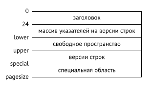

# Страницы и версии строк

* [Структура страниц](#struct)
* [Структура версии строк](#structVer)
* [Выполнение операций над версиями строк](#op)


<a name="struct"></a>

## Структура страниц

Каждая страница имеет внутреннюю структуру, как правило содержит следующие разделы:

* заголовок
* массив указателей на версии строк
* свободное пространство
* версии строк
* специальную область

**Заголовок страницы**

Заголовок страницы распологается в младших адресах и имеет фиксированный размер. Он хранит различныую инофрмацию, такую как контрольная сумма, а также размер всех остальных областей.

Размер легко получить с помощью расширения `pageinspect`. Заглянем в самую первую страницу таблицы (нумерация начинается с нуля):

``` sql
CREATE EXTENSION pageinspect;
SELECT lower, upper, special, pagesize
FROM page_header(get_raw_page('accounts',0));

 lower | upper | special | pagesize 
-------+-------+---------+----------
   152 |  6904 |    8192 |     8192
(1 строка)
```



**Специальная область**

Специальная область расположена в противоположенном конце страницы, в старших адресах. Она используется некоторыми типами индексов для хранения вспомогательной информации.

В целом индексные страницы устроены более разнообразно, и их содержимое зависит от конкретного типа индекса. И даже у одного типа индекса бывают разные виды страниц.

**Версии строк** 

Перед специальной областью распологаются *строки (rows)* - те самые данные, которые хранятся в базе, с добавлением некоторой служебной информации.

В случае таблиц, мы говорим не просто о строках, а о версиях строк, поскольку многоверсионность предпологает существование нескольких версий одной и той же строки. На индексы многоверсионность не распространяется, вместо этого индексы ссылаются на все возможные табличные версии строк, среди которых по правилам видимости выбираются подходящие.

**Указатели на версии строк**

Массив указателей на версии строк служит оглавлением страницы. Он располагается сразу за заголовком.

Индексные строки должны как-то ссылаться на версии строк в таблице. Для этого используются шестибайтные идентификаторы версий строк (tuple id, tid). Идентификатор состоит из номера страницы в файле основного слоя и должен еще содержать какое-то указание на версию строки в этой странице.

В качестве такого указания можно было бы использовать смещение относительно начала страницы. Но тогда версию строки нельзя было бы перемещать внутри страницы, не сломав ссылки из индексов. А это привело бы к фрагментации места внутри страниц и другим неприятным последствиям.

Поэтому используется косвенная адресация: идентификатор версии ссылается на номер указателя, а уже указатель — на текущую позицию версии строки в странице. При перемещении версии строки ее идентификатор не меняется; достаточно изменить указатель, который находится на той же странице.

Каждый указатель занимает ровно 4 байта и содержит:

* смещение версии строки относительно начала страницы
* длину версии строки
* несколько битов, определяющих статус версии строки

**Свободное место**

Между указателями и версиями строк может оставаться свободное место. Никакой фрагментации страницы не бывает, все свободное место всегда представлено одним фрагментом.

<a name="structVer"></a>

## Структура версии строк

Версия строки состоит из заголовка, за которым следуют собственно данные. Заголовок версии содержит множество полей, среди которых:

*xmin,xmax - номера транзакций, которые отличают данную версию от других версий той же строки;

* infomask - ряд информационных битов, определяющих свойство версии;

* ctid - ссылка на следующую, более новую версию той же строки;

* битовая карта неопределенных значений - массив битов, отмечающих столбцы, которые допускают неопределенные значения (NULL).

В результате заголовок получается довольно большой - 23 байта на каждую версию строки, а обычно больше изза карты неопределенных значений и из-за обязательного выравнивания начала данных. Для "узкой" таблицы объем служебных данных может превышать объем полезных данных.

Формат данных на диске полностью совпадает с представление данных в оперативной памяти. Страница вместе с версиями строк читается в буферный кеш "как есть", без каких бы то ни было преобразований. Поэтому файлы данных с одной платформы оказываются несовместимыми с другими платформами.

<a name="op"></a>

## Выполнение операций над версиями строк

Чтобы разные версии одной и той же строки можно было различить, каждая из версий имеет две отметки, определяющие ее «время действия», — xmin и xmax. Но используется не время как таковое, а постоянно увеличивающийся счетчик номеров транзакций.

Когда строка создается, значение xmin устанавливается равным номеру транзакции, выполнившей команду INSERT.

Когда строка удаляется, значению xmax текущей версии присваивается номер транзакции, выполнившей команду DELETE.

Команду UPDATE можно в некотором приближении рассматривать как две операции: DELETE и INSERT. В текущей версии строки устанавливается значение xmax, равное номеру транзакции, выполнившей UPDATE. Затем создается новая версия той же строки; значение xmin у нее совпадает со значением xmax предыдущей версии. Точно так же и команда MERGE «распадается» на элементарные вставки и удаления.

Посмотрим, как выполняются разные операции с версиями строк на низком уровне 1.

Для экспериментов понадобится таблица с двумя столбцами и индексом по одному из них:

``` sql
CREATE TABLE t(
id integer GENERATED ALWAYS AS IDENTITY,
s text
);
CREATE INDEX ON t(s);
```